<h1 align="center">Spring Boot Gateway with Spring Cloud and WebFlux</h1>

<p align="center">A high-concurrency, reactive API Gateway built with Spring Boot 4.0.5 and Spring Cloud Gateway (WebFlux). 
This service acts as a centralized entry point for microservices, managing security, resilience, and traffic.</p>


---

## Project Overview

The API Gateway Service is a Spring Cloud Gateway-based microservice that acts as a single entry point for all client requests. It provides essential cross-cutting concerns such as authentication, authorization, rate limiting, and circuit breaking, allowing downstream microservices to focus on business logic.

Built with Spring Boot 4.0.5 and Spring Cloud Gateway (WebFlux), the system leverages a non-blocking, reactive architecture to handle high volumes of concurrent requests with minimal resource consumption.

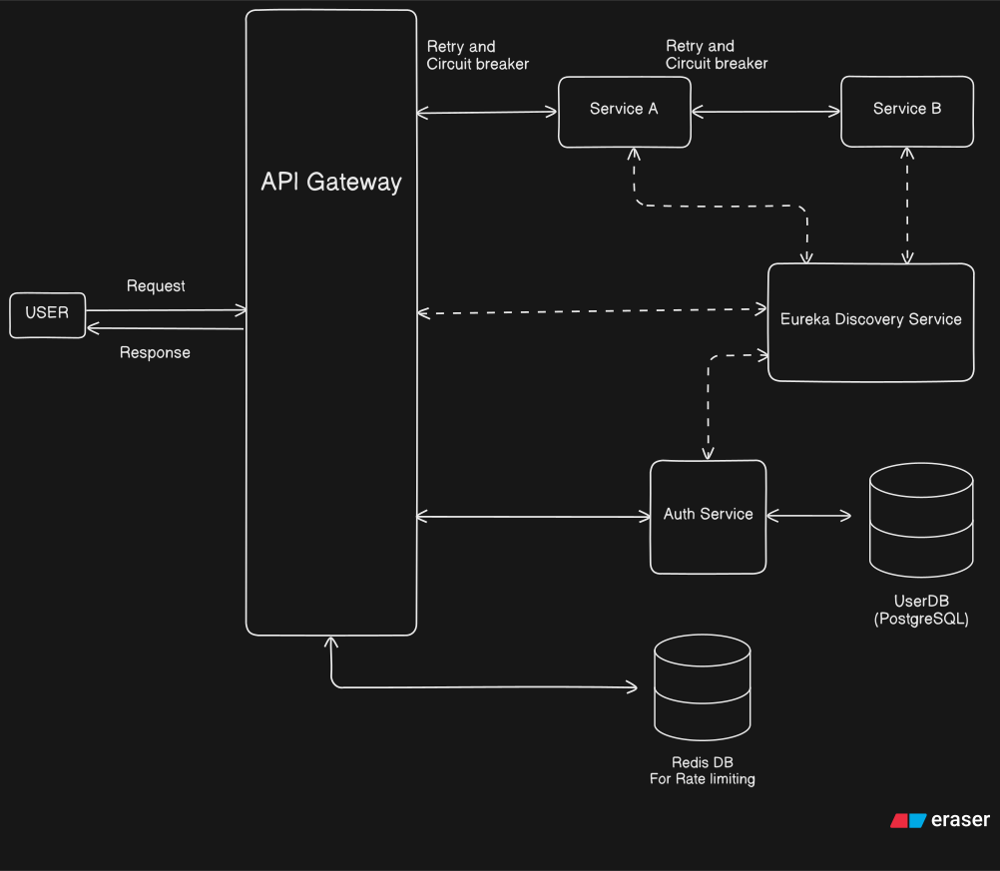

## Tech Stack

- **Java**: 25
- **Spring Boot**: 4.0.5
- **Spring Cloud**
- **Spring Cloud Gateway**: WebFlux-based reactive gateway
- **Spring Security**
- **Spring Cloud Netflix Eureka**: Service discovery
- **Resilience4j**: Circuit breaker and retry patterns
- **Redis**: Distributed rate limiting and caching
- **JWT (jjwt)**: Token-based authentication (api, impl, jackson)
- **Lombok**: Boilerplate code reduction
- **Postgres** for storing user data

## Features
- **API request dynamic routing** (using Eureka service discovery)
- **API rate limiting per IP**
- **Authentication**
- **Authorization**
- **Upstream and Downstream API details logging**
- **Circuit Breaking and Resilience Patternsry** (exponential retry + jitter)
- **Monitoring & Actuator**
- **Error handling**

---

## Detailed Request Processing Flow

When a user makes a request, it follows a deterministic path through the gateway infrastructure designed for high throughput.

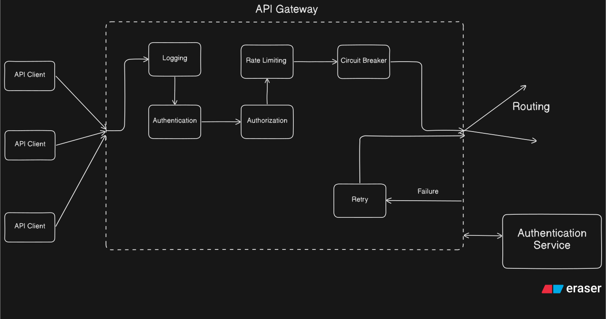

### Internal Execution Logic

1. Netty Server: The entry point for all incoming TCP connections. It handles requests asynchronously using an event-loop model.
2. HttpWebHandlerAdapter: Converts the low-level Netty request into a high-level ServerWebExchange.
3. RoutePredicateHandlerMapping: Iterates through defined routes to find a match based on predicates (e.g., path, headers).
4. FilteringWebHandler: Assembles the global filters and route-specific filters into a executable chain.
5. Pre-Filters: Filters execute in order (e.g., Logging -> Rate Limiting -> Auth -> Role). If any filter fails, the chain is broken and an error is returned.
6. NettyRoutingFilter: The final pre-filter that uses the LoadBalancerClient to resolve the service instance from Eureka and forwards the request.
7. Post-Filters: Filters execute in reverse order after receiving the response from the microservice (e.g., modifying response headers, logging final status).

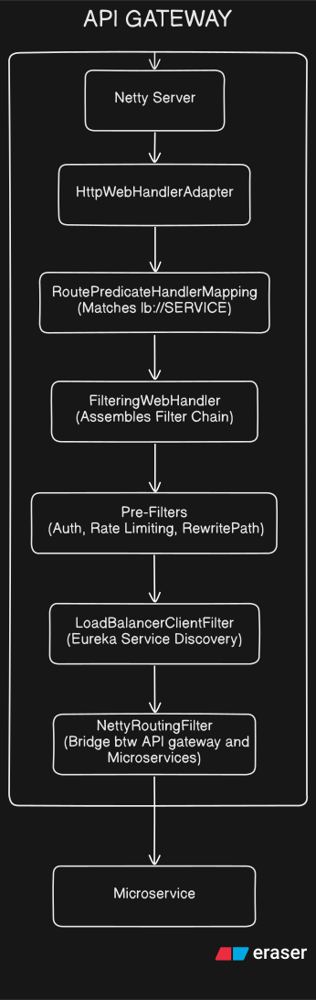

---

### Filters
```
    Global Logging Filter
        ↓
    Auth Filter
        ↓
    Role Filter
        ↓
   Rate Limiting Filter
        ↓
      Retry
        ↓
    Circuit Breaker
```

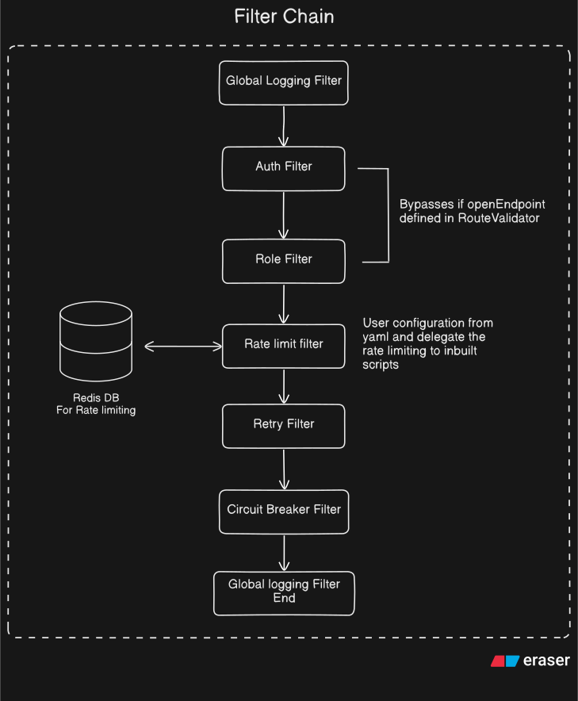

---

## Core Features and Implementation

### 1. Dynamic Routing and Service Discovery
The gateway uses the "lb://" prefix in route URIs to trigger the LoadBalancerClient. It queries the Eureka Discovery Service to get a list of healthy instances for a given service name and applies a load-balancing strategy (e.g., Round Robin) to forward the request.

### 2. Distributed Rate Limiting
Implements the Token Bucket algorithm using Redis.
- How it works: Each request consumes a "token" from a bucket in Redis. Tokens are replenished at a fixed rate. If the bucket is empty, the request is rejected with a 429 status.
- Distribution: Because state is stored in Redis, multiple gateway instances share the same rate limit for a specific user or IP.

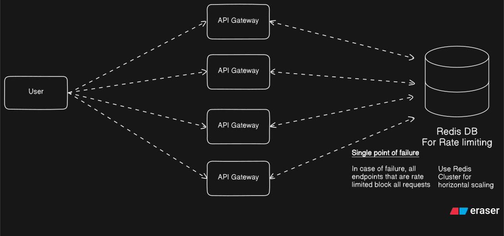

### 3. JWT Authentication and Identity Propagation
The AuthenticationFilter validates incoming JWTs at the gateway edge.
- Validation: Checks signature (HMAC-SHA256), expiration, and issuer.
- Header Enrichment: Extracts claims (userId, role) and adds them to request headers (X-User-Id, X-User-Role).
- Security: Automatically strips any incoming X-User headers from the client to prevent header spoofing.

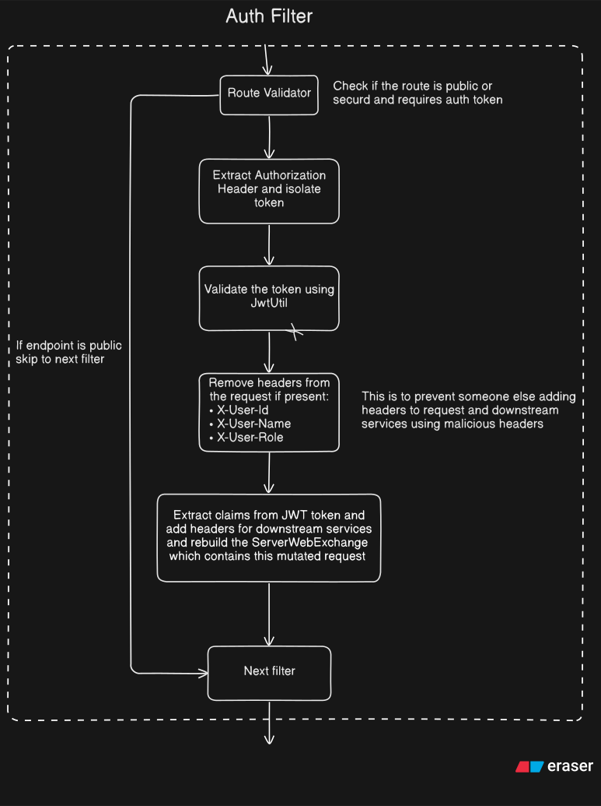

### 4. Role-Based Access Control (RBAC)
The RoleFilter enforces fine-grained authorization. It compares the role extracted during authentication against the required role defined in the route configuration. Admin users are granted a global override to bypass specific role checks.

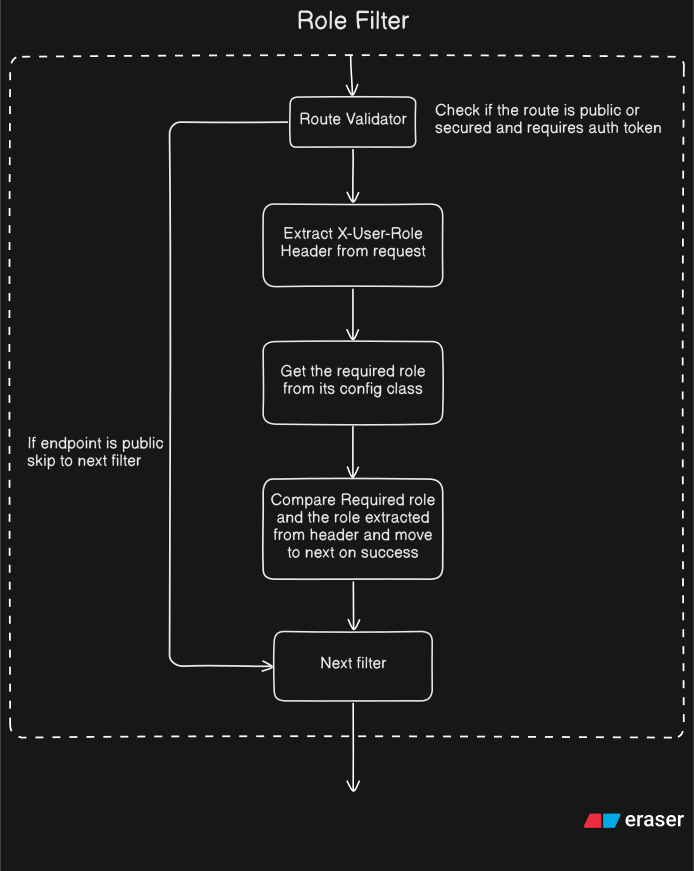

---

## Resilience and Fault Tolerance

### Circuit Breaker (Resilience4j)
Prevents a single failing service from taking down the entire system.
- Closed State: Normal operation, requests flow through.
- Open State: Failure threshold reached; requests are immediately diverted to a fallback endpoint (FallbackController) without hitting the downstream service.
- Half-Open State: Periodically allows a few requests to test if the service has recovered.

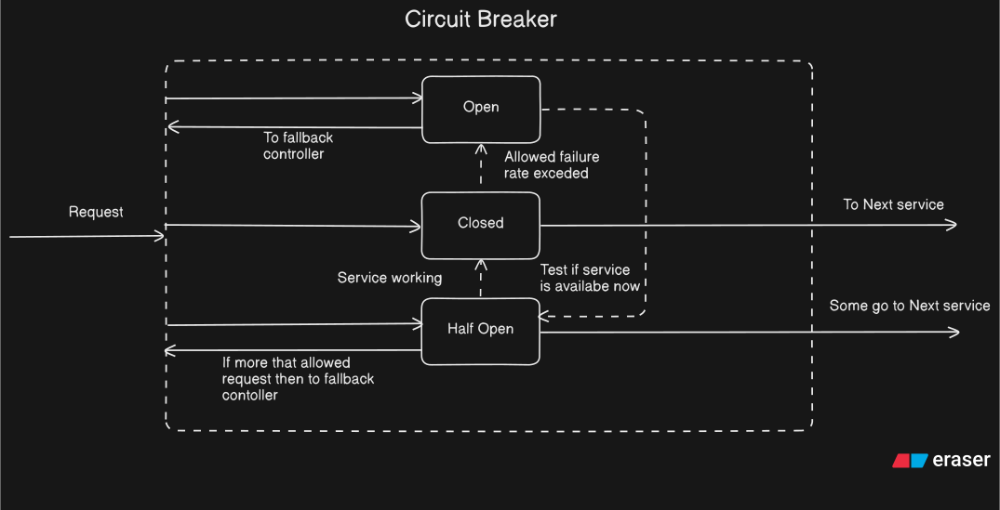

### Retry Mechanism
Automatically re-attempts requests for idempotent methods (GET, PUT) if the initial attempt results in transient errors like 503 (Service Unavailable) or 504 (Gateway Timeout). It uses exponential backoff to avoid overwhelming a recovering service.

---

## Auth Service Operations

The Auth Service serves as the identity provider for the system.

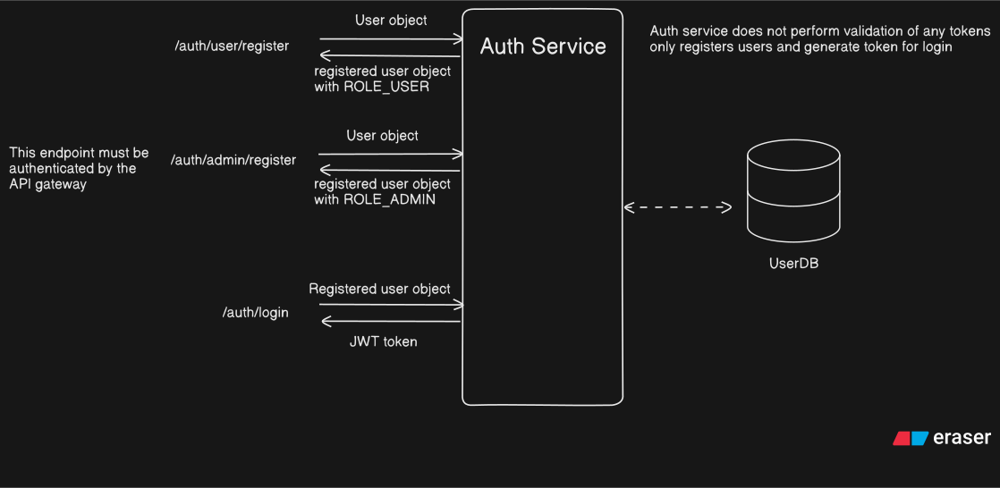

### Registration and Login
- User Registration: Validates inputs, hashes passwords using BCrypt, and stores the user in Postgres.
- Login: Authenticates credentials and issues a signed JWT containing the user's role and unique ID.

| User Registration | Admin Registration |
| :---: | :---: |
| 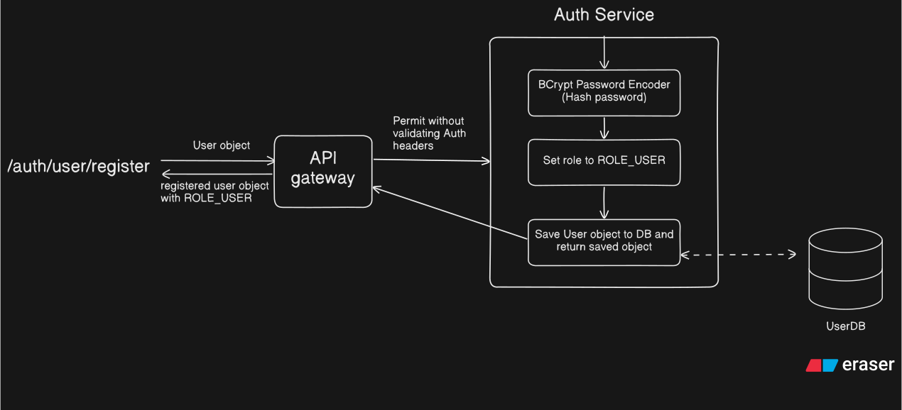 | 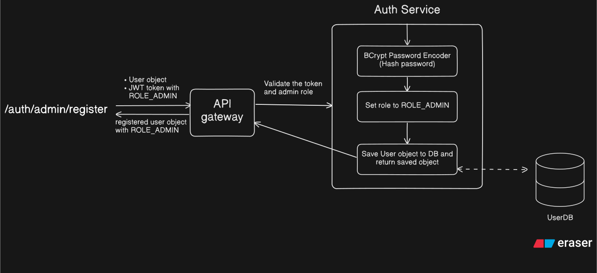 |

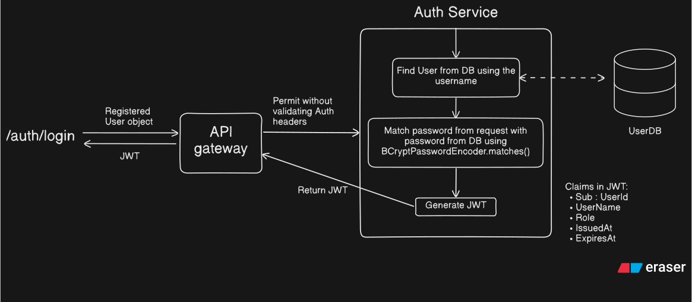

---

## Docker Quick Start

To deploy the full infrastructure including Discovery, Auth, Gateway, Redis, and Postgres:

```bash
# Prepare environment
cp SAMPLE.env .env

# Configure .env

# Start infrastructure
docker-compose up --build -d
```

### Access Points
- API Gateway: http://localhost:8080
- Eureka Dashboard: http://localhost:8761
- Spring Admin Dashboard: http://localhost:9090
- Postgres: localhost:5432
- Redis: localhost:6379